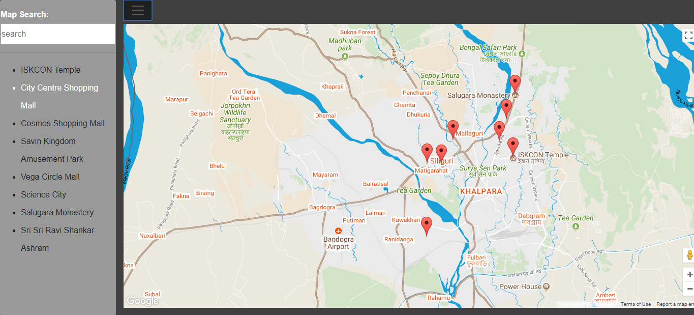

frontend-nanodegree-neighborhood-maps
=====================================

## Description

This is a map of Siliguri. This place thrives on tourism. So, this is to help all the tourists who wish to explore this place.

## Instructions
* run the file index.html in google chrome.
* select any address from the list which you interest you.
* there is a menu button which displays and hides the list of places.
* click on the (list item/marker) to get information about that place.

## Framework used

* Bootstrap Framework
* Knockout Framework

## Supporting Api used

* Foursquare Api.
* Google Maps Api.

## How it should look like

## Reference

[knockout](knockoutjs.com)

[learn knockout](learn.knockoutjs.com)

[bootstrap](https://www.w3schools.com/bootstrap4/default.asp)

[jquery](http://api.jquery.com/)
